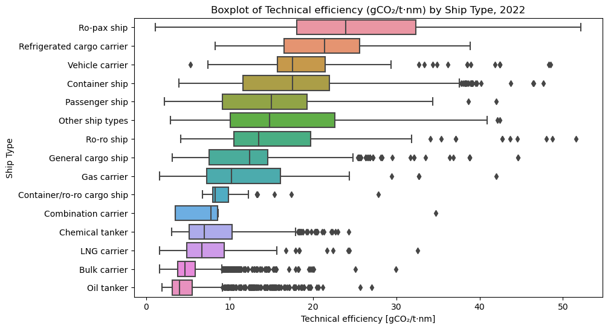

# EU-MRV Ship CO₂ Emissions Analysis
An analysis of the EU-MRV records of the carbon dioxide emissions profiles of vessels moving to, from and between European Union member states.

## About the dataset

EU-MRV is an EU regulation on the monitoring, reporting, and verification of carbon dioxide (CO₂) emissions from ships, which first entered into force on 1 July 2015. All ships of 5000 gross tonnage (GT) and above are required to report data regarding the emissions released during their voyages from and/or to ports in the European Economic Area. The monitoring plans used to make these reports need to be submitted to an accredited verifier. Full details of this arrangement can be seen in [the European Commission's FAQ](https://climate.ec.europa.eu/eu-action/transport/reducing-emissions-shipping-sector/faq-monitoring-reporting-and-verification-maritime-transport-emissions_en).

This notebook explores the yearly emissions data made available by the European Commission at https://mrv.emsa.europa.eu/#public/emission-report. Data is available for the years 2018 to 2022. The yearly datasets are included in the `/data/raw` directory.

## About the notebook

We focus on exploring the data in order to answer the following questions:

- How many ships of each type are there?
- How do the emissions profiles differ for the different ship types?
- What is the relationship between ship deadweight and emissions intensity?
- How many miles did each vessel in the database travel?

We also suggest some areas for further investigation.